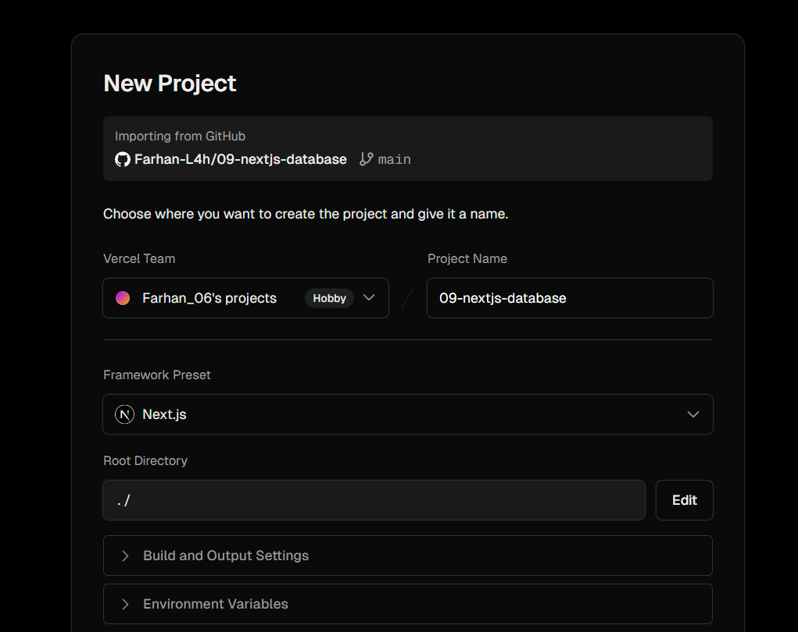
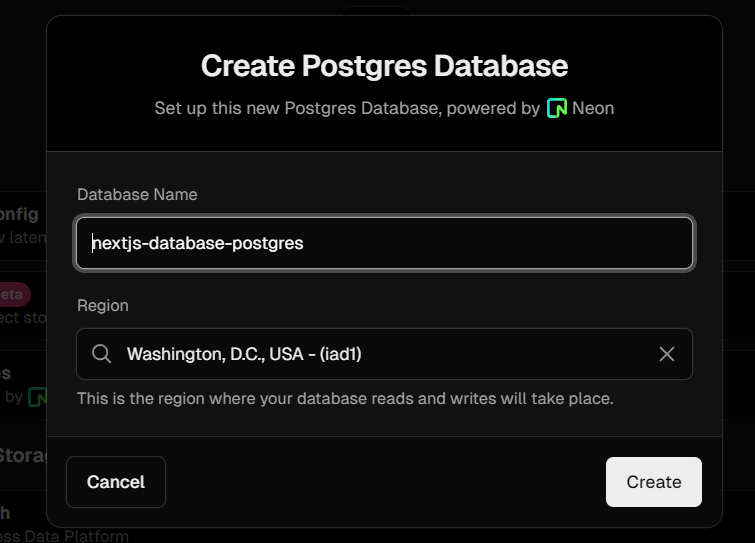

This is a [Next.js](https://nextjs.org/) project bootstrapped with [`create-next-app`](https://github.com/vercel/next.js/tree/canary/packages/create-next-app).

## Getting Started

First, run the development server:

```bash
npm run dev
# or
yarn dev
# or
pnpm dev
# or
bun dev
```

Open [http://localhost:3000](http://localhost:3000) with your browser to see the result.

You can start editing the page by modifying `app/page.tsx`. The page auto-updates as you edit the file.

This project uses [`next/font`](https://nextjs.org/docs/basic-features/font-optimization) to automatically optimize and load Inter, a custom Google Font.

## Belajar Node.JS

Memahami Tentang Node.js, fungsi, dan cara membuat project node.js

## Vercel

membuat akun vercel 


Deploy Project Di vercel


## Database
Konfigurasi env untuk database

Membuat database mengunakan Postgres


## Melakukan Seed Ke Database

Memlakukan seed ke database dengan mengunakan perintah npm run seed


